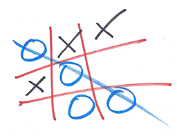

#Qualisys - Code challenge#

Your mission, should you choose to accept it, is to crate a simple game of **Tic-tac-toe**. The game should be
structured using Angular controllers and views. This starter pack contains a basic Angular application structure with
an empty starting view. The game should, at a minimum be able to handle state and the high score of who is winning. It
is not nessesary to implement a computer to play against, a 2 player game in the browser is fine. You can spend as much
or little time as you feel is necessary but **no more than 5 hours**. It is okay to submit a non-finished project as
long as the base functionallity is there.




##Prerequisites##
* Node ^5.5.0
* Bower
* Gulp

##How to get started##
* Fork or download this project
* Install npm dependencies ```$ npm install```
* Install bower dependencies ```$ bower install```
* Start the development server which will watch for file changes and uses hot reload with ```$ gulp serve```

You should now see an orange page with a white box saying Tic-tac-toe and the same picture as above. Feel free to change
this in anyway you see fit :)

##What is included in this project##
* Angular 1.5
* Angular UI Router
* Twitter bootstrap
* SASS to CSS compile task

##How to submit##
* If you forked this project just push your changes and send us an email with the url to your public fork or make sure to
invite us so we can view your private project. Alternatively send us your project **without** node or bower dependencies
as a zipped file.

##What happens next##
We'll take a few days to look through your code, then we'll make an assessment
together with our thoughts from the interview.

##Troubleshooting##

`Local gulp not found in ...`
Make sure you run npm install.

`npm WARN deprecated`
If you get some warnings when installing npm packages you can ignore these for now.
